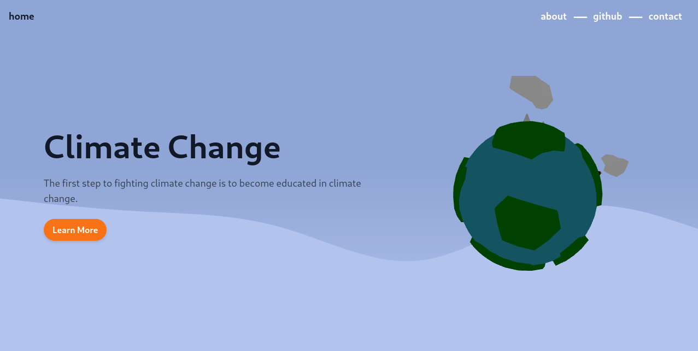
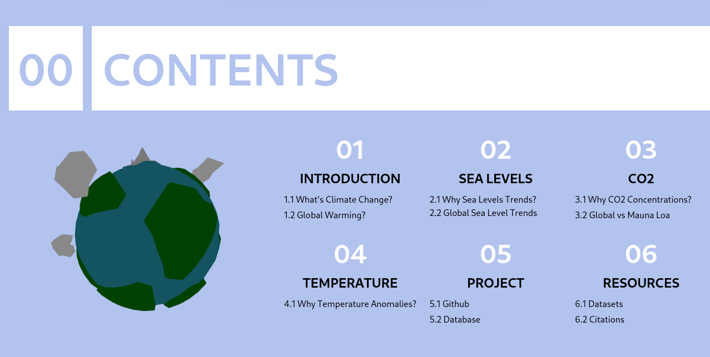
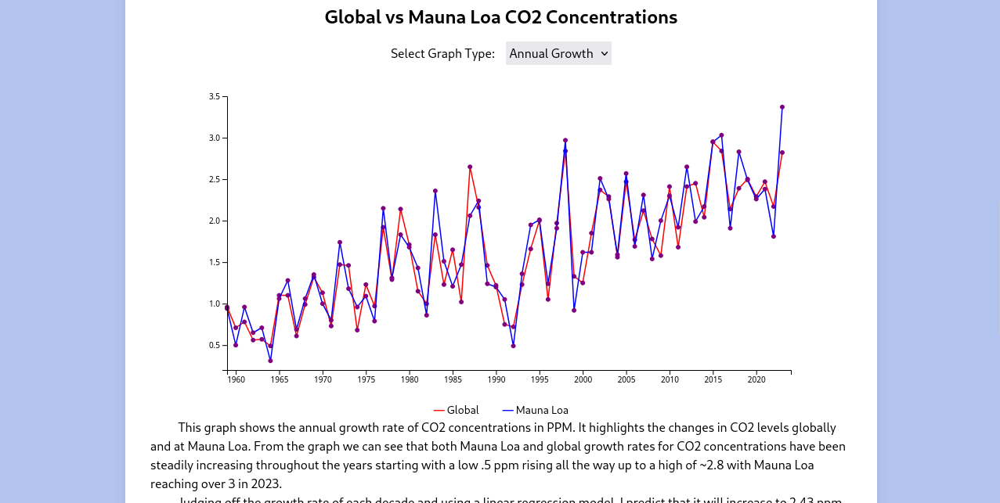
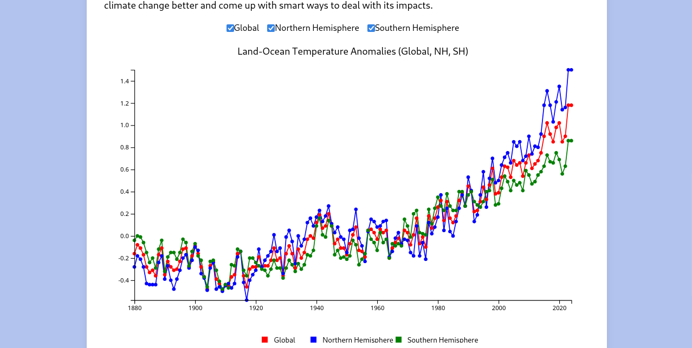
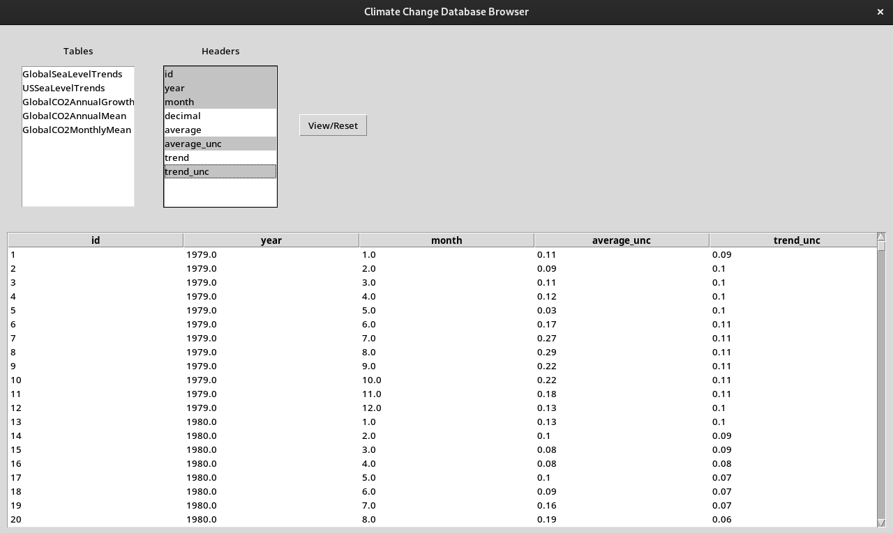

# Climate Change Data Analysis and Visualization

## About This Project

### Overview
This repository contains a comprehensive data analysis and visualization tool designed to track and understand climate change trends. By leveraging historical temperature records and other climate-related datasets, this project aims to provide insights into global warming and its impacts on the environment.

#### Currently Under Review
The website is very close to being deployed it just needs a few more fixes. Here are some screenshots of how its coming along behind the scenes!






### Objectives
- **Data Collection**: Gather and process historical climate data from reputable sources.
- **Data Cleaning**: Ensure data integrity through thorough cleaning and preprocessing.
- **Visualization**: Create intuitive visualizations to make complex climate data more accessible and understandable.
- **Analysis**: Conduct detailed analysis to identify trends and patterns in climate change data.

### Key Features
- **Historical Temperature Records**: Analysis of global temperature anomalies from various datasets.
- **Data Cleaning Process**: Comprehensive steps to handle missing values and ensure data accuracy.
- **Interactive Visualizations**: User-friendly charts and graphs to illustrate climate trends.
- **Extensible Architecture**: Modular design that allows for easy addition of new datasets and analysis methods.

### Technologies Used
- **Python**: For data processing, analysis, and visualization.
- **Sqlite3**: For holding all datasets for quick access.
- **Shutil**: For making backup databases.
- **Pandas**: For data manipulation and cleaning.
- **Tabulate**: For data formatting in inspection files.
- **Git**: For version control and collaboration.

### Getting Started
1. **Clone the Repository**:
   ```
   git clone https://github.com/AlexOcegueda/ClimateChange.git
   ```

2. **Install Dependencies**:
   ```
   pip install -r requirements.txt
   ```

### Viewing the Database



To view the database follow these steps:
  ```
  cd database/database_scripts
  ```
Run the database.py file
  ```
  python database.py
  ```

#### How to use database
- Simply click a table and hit 'View/Reset' to see all columns in table.
- Click on header options to select only the columns you want to see.
- Click on the column names on the table displayed to sort from a-z or highest-lowest. Clicking again will reverse it to z-a or lowest-highest.
- Click the 'View/Reset' if you want it to display without any sorting filter to the table.

#### Tables in Database

GlobalSeaLevelTrends:

- Description: Contains global sea level trend data.
- Data: Includes station IDs, station names, year range, mean sea level trends, confidence intervals, and geographic coordinates.

USSeaLevelTrends:

- Description: Contains sea level trend data for the United States.
- Data: Includes station IDs, station names, year range, mean sea level trends, confidence intervals, and geographic coordinates.

GlobalCO2AnnualGrowth:

- Description: Contains global annual growth rates of CO2 concentrations.
- Data: Includes year, annual increase in CO2, and uncertainty values.

GlobalCO2AnnualMean:

- Description: Contains global annual mean CO2 concentrations.
- Data: Includes year, mean CO2 concentrations, and uncertainty values.

GlobalCO2MonthlyMean:

- Description: Contains global monthly mean CO2 concentrations.
- Data: Includes year, month, decimal year, monthly average CO2 concentrations, trend values, and uncertainties.

CO2AnnualMeanMLO:

- Description: Contains annual mean CO2 concentrations from Mauna Loa Observatory.
- Data: Includes year, mean CO2 concentrations, and uncertainty values.

CO2DailyMLO:

- Description: Contains daily CO2 concentrations from Mauna Loa Observatory.
- Data: Includes year, month, day, decimal year, and CO2 concentrations.

CO2GrowthRateMLO:

- Description: Contains annual CO2 growth rates from Mauna Loa Observatory.
- Data: Includes year, annual increase in CO2, and uncertainty values.

CO2MonthlyMeanMLO:

- Description: Contains monthly mean CO2 concentrations from Mauna Loa Observatory.
- Data: Includes year, month, decimal date, monthly average CO2 concentrations, deseasonalized values, number of days, standard deviations, and uncertainties.

CO2WeeklyMeanMLO:

- Description: Contains weekly mean CO2 concentrations from Mauna Loa Observatory.
- Data: Includes year, month, day, decimal year, weekly average CO2 concentrations, number of days, and increases since 1800.

GlobalAirsTempAnomalies:

- Description: Contains global temperature anomalies using Atmospheric Infrared Sounder (AIRS).
- Data: Includes year, monthly temperature anomalies, and seasonal/annual means.

NHAIRSTempAnomalies:

- Description: Contains Northern Hemisphere temperature anomalies using Atmospheric Infrared Sounder (AIRS).
- Data: Includes year, monthly temperature anomalies, and seasonal/annual means.

SHAIRSTempAnomalies:

- Description: Contains Southern Hemisphere temperature anomalies using Atmospheric Infrared Sounder (AIRS).
- Data: Includes year, monthly temperature anomalies, and seasonal/annual means.

ZonAIRSAnnTempAnomalies:

- Description: Contains zonal annual temperature anomalies using Atmospheric Infrared Sounder (AIRS).
- Data: Includes year, global, hemispheric, and zonal temperature anomalies.

LandOceanNHMean:

- Description: Contains Northern Hemisphere land-ocean temperature anomalies.
- Data: Includes year, monthly temperature anomalies, and seasonal/annual means.

LandOceanSHMean:

- Description: Contains Southern Hemisphere land-ocean temperature anomalies.
- Data: Includes year, monthly temperature anomalies, and seasonal/annual means.

LandOceanZonAnnTsMean:

- Description: Contains zonal annual land-ocean temperature anomalies.
- Data: Includes year, global, hemispheric, and zonal temperature anomalies.

LandOceanGlobalMean:

- Description: Contains global land-ocean temperature anomalies.
- Data: Includes year, monthly temperature anomalies, and seasonal/annual means.

## Data Sources
[List of the datasets you are using, with links to their sources]

- **Historical Temperature Records**: 
  - [NASA GISS Temperature Data](https://data.giss.nasa.gov/gistemp/)
- **Atmospheric CO2 Concentrations**: 
  - [Mauna Loa CO2 Data](https://gml.noaa.gov/ccgg/trends/data.html)
  - [Global CO2 Data](https://gml.noaa.gov/ccgg/trends/gl_data.html)
- **Sea Level Rise**:
  - [NOAA Global Mean Sea Level Trends](https://tidesandcurrents.noaa.gov/sltrends/mslGlobalTrendsTable.html)
  - [NOAA US Mean Sea Level Trends](https://tidesandcurrents.noaa.gov/sltrends/mslUSTrendsTable.html)

## Credits
Special thanks to the data providers for making their data publicly available:

- **NASA GISS**: [NASA's Goddard Institute for Space Studies](https://data.giss.nasa.gov/gistemp/)
  - "These data are made freely available to the public and the scientific community in the belief that their wide dissemination will lead to greater understanding and new scientific insights."
  - GISTEMP Team, 2024: GISS Surface Temperature Analysis (GISTEMP), version 4. NASA Goddard Institute for Space Studies. Dataset accessed 2024-06-17 at https://data.giss.nasa.gov/gistemp/.
  - Lenssen, N., G. Schmidt, J. Hansen, M. Menne, A. Persin, R. Ruedy, and D. Zyss, 2019: Improvements in the GISTEMP uncertainty model. J. Geophys. Res. Atmos., 124, no. 12, 6307-6326, doi:10.1029/2018JD029522. Dataset accessed 2024-06-17 at https://data.giss.nasa.gov/gistemp/.

- **NOAA GML**: [Atmospheric CO2 Concentrations](https://gml.noaa.gov/ccgg/trends/)
  - "These data are made freely available to the public and the scientific community. Contact: Xin Lan (xin.lan@noaa.gov) and Ralph Keeling (rkeeling@ucsd.edu)."
  - "Dr. Xin Lan, NOAA/GML (https://gml.noaa.gov/ccgg/trends/) and Dr. Ralph Keeling, Scripps Institution of Oceanography (https://scrippsco2.ucsd.edu/)."

- **NOAA Tides and Currents**: [Global Linear Relative Sea Level Trends](https://tidesandcurrents.noaa.gov/sltrends/mslGlobalTrendsTable.html)
  - "Data provided by NOAA Tides and Currents. Accessed on 2024-06-17."
  - Contact them: (https://tidesandcurrents.noaa.gov/contact.html)

- **NOAA Tides and Currents**: [US Linear Relative Sea Level Trends](https://tidesandcurrents.noaa.gov/sltrends/mslUSTrendsTable.html)
  - "Data provided by NOAA Tides and Currents. Accessed on 2024-06-17."
  - Contact them: (https://tidesandcurrents.noaa.gov/contact.html)
